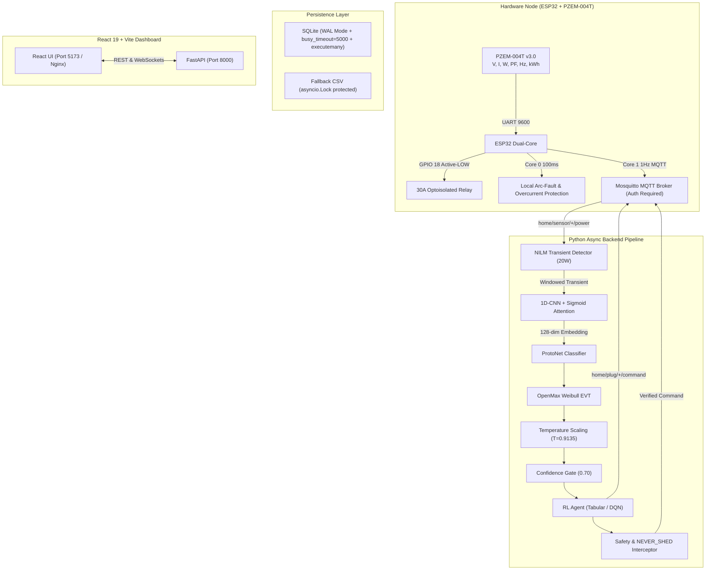

# Digital Twin EMS & ProtoNet Pipeline — AI Context, Discoveries & Hardware Spec

**Date Compiled:** August 21, 2026  
**Stack Status:** ✅ **224/224 Backend Pytests Passed** | ✅ **13/13 Frontend Vitests Passed** | ✅ **10/10 HIL Passed** | ✅ **7/7 Stress Tests Passed** | ✅ **8/8 Closed-Loop Stages Passed** | ✅ **Graphify Knowledge Graph Synced** (1,553 nodes, 3,544 edges)

This document serves as the permanent reference point for AI models and engineers maintaining or deploying this repository.

---

## 1. System Architecture

---

## 2. Component Status & Verified Metrics

| Subsystem | Metric / Implementation | Status |
|---|---|---|
| **ProtoNet (ML)** | 159,585 parameters, Sigmoid temporal gating (preserves 28.8% energy), 10 appliance classes, 12,000 episode weights | ✅ **Fully Operational (87.7% Accuracy)** |
| **Calibration** | Temperature scaler $T \approx 0.9135$, Weibull EVT open-set distance modeling | ✅ **Operational** |
| **Thermodynamics** | ISO 7730 PMV calculation $[-3.0, 3.0]$, Category A comfort bounds $[-0.5, 0.5]$ | ✅ **Operational** |
| **NILM Pipeline** | Savitzky-Golay derivative detector, 20W threshold, 5s cooldown, overlap subtraction | ✅ **Operational** |
| **RL Optimization** | Tabular Q-Learning + DQN option, 300s anti-short-cycling, daily epsilon decay, NEVER_SHED immunity | ✅ **Operational** |
| **Hardware Safety** | Edge dP/dt > 1000 W/s arc-fault trip, 125% rated overcurrent, offline-first task boot, inrush baseline filter | ✅ **Operational** |
| **Database** | SQLite with WAL mode, `PRAGMA busy_timeout=5000`, `executemany` batching (**43.9k writes/sec**), daily retention cleanup + `VACUUM` | ✅ **Operational** |
| **Docker Stack** | 4-service stack (`mosquitto`, `ems-pipeline`, `ems-api`, `frontend`) with auth & healthchecks | ✅ **Operational** |
| **Firmware Simulation** | Bit-for-bit Dual-Core FreeRTOS emulator with Core 0 safety loop and Core 1 telemetry/ACKs | ✅ **Operational** |

---

## 3. Critical Fix History & Audit Discoveries

1. **API Security Bypass:** Strict token checking enforced in `src/api/main.py`.
2. **Unauthenticated MQTT Broker:** `mosquitto.conf` requires auth; pipeline, API, firmware, and simulators pass credentials.
3. **Firmware Stack Overflow:** Eliminated VLA in MQTT callback, replaced with bounded static buffer.
4. **Data Corruption via NaN/Inf:** Sanitization added in `run_pipeline.py`, `safety.py`, and `watchdog.py`.
5. **CSV Fallback Concurrency:** Protected by `asyncio.Lock()` across all modules.
6. **Unbounded Memory Leaks:** State maps bounded and sanitized.
7. **Database File Bloat & Concurrency:** Added `PRAGMA busy_timeout=5000;`, `executemany` query grouping, and periodic `VACUUM`.
8. **Pre-Trigger Inrush Sliding Baseline:** Fixed baseline computation order in firmware and simulation to calculate average *prior* to inserting the new sample, allowing 1200W motor starting inrushes without false trips.
9. **Directional Arc-Fault Trigger:** Restricted arc-fault calculation to positive power surges ($P_{\text{new}} > P_{\text{old}}$) to prevent normal load turn-offs or step-downs from triggering false arc-faults.
10. **Indian DISCOM Tariff Localization:** Migrated all cost calculations to Indian Rupee (INR) ToU slabs (₹8.0/₹6.5/₹4.0 per kWh).

---

## 4. Hardware Friction & Shadow Mode Protocol

Before deploying active RL relay cutoffs on live home appliances:
1. **Sensor Tuning:** Calibrate PZEM-004T against a known reference load (e.g., 100W incandescent bulb) using `scripts/calibrate_ct.py` to verify current transformer scaling.
2. **Passive Ingestion (1–2 Weeks):** Keep `RLAction` in passive monitoring mode to collect real compressor inrush currents, harmonic distortions, and inverter AC ramps into the prototype registry.
3. **Environmental Telemetry:** For accurate PMV thermal comfort calculations during extreme weather, attach a physical DHT22/BME280 sensor to the ESP32 I2C bus (GPIO 21/22) and publish to `home/sensor/{id}/environment`.
4. **Policy Promotion:** Active relay shedding is only unlocked once the policy demonstrates 50 consecutive validation episodes with PMV penalty $\le 0.5$.
