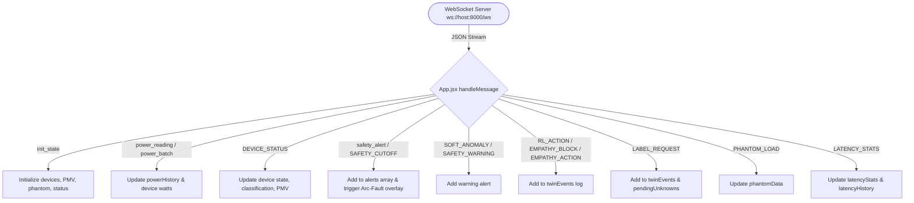

# EMS Frontend Framework Context & Architecture Guide

> **Purpose:** This document provides a complete, authoritative context map of the frontend framework, its directory structure, every source file and its operational role, data flow, WebSocket message protocols, styling system, and test suite. AI coding models can reference this document directly to inspect, modify, or extend the frontend without scanning raw directories or files.

---

## 1. Executive Summary & Tech Stack

The frontend is a high-performance, real-time energy management and digital twin monitoring dashboard for the Smart Home Energy Management System (EMS). It provides sub-second live telemetry visualization (1Hz), anomaly & arc-fault alerts, reinforcement learning (RL) optimization insights, PMV (Predicted Mean Vote) thermal comfort monitoring, phantom load tracking, and interactive device labeling.

| Category | Technology | Version / Spec |
| :--- | :--- | :--- |
| **Framework** | React | `^19.2.5` |
| **Build Tool & Dev Server** | Vite | `^8.0.9` (ES Modules, HMR) |
| **Data Visualization** | Recharts | `^3.8.1` (ResponsiveContainer, LineChart, BarChart) |
| **Iconography** | Lucide React | `^1.8.0` |
| **Styling** | Pure CSS3 + Custom Properties | Dark Cyberpunk / Glassmorphic Design System |
| **Testing** | Vitest + React Testing Library | Vitest `^4.1.10`, RTL `^16.3.2`, `jsdom ^29.1.1` |
| **Real-Time Transport** | Native WebSocket | `ws://<host>:8000/ws` with exponential backoff |
| **REST API** | Fetch API | `http://<host>:8000/api/*` |
| **Knowledge Graph Tool** | Graphify (`graphifyy`) | `0.8.35` (AST code graph in `frontend/graphify-out/`) |

---

## 2. Directory Tree Map

```
frontend/
├── eslint.config.js                  # ESLint flat config with React Hooks & Refresh plugins
├── index.html                        # HTML5 single-page application entry point
├── package.json                      # NPM scripts and dependencies
├── package-lock.json                 # Exact dependency lockfile
├── vite.config.js                    # Vite & Vitest test runner configuration
├── README.md                         # Project template readme
│
├── public/                           # Static assets served at root
│   ├── favicon.svg                   # Browser tab icon (SVG)
│   └── icons.svg                     # Vector asset collection
│
├── src/                              # Application source code
│   ├── main.jsx                      # React 19 root bootstrap (`createRoot`)
│   ├── App.jsx                       # Root component, WebSocket client, global state & page routing
│   ├── index.css                     # Global design tokens, CSS variables, typography, keyframes
│   ├── App.css                       # Layout shell, header, panels, status badges, arc-fault overlay
│   ├── setupTests.js                 # Vitest test setup (jest-dom matchers, ResizeObserver mock)
│   │
│   ├── assets/                       # Bundled static media
│   │   ├── hero.png                  # Dashboard hero banner graphic
│   │   ├── react.svg                 # React logo
│   │   └── vite.svg                  # Vite logo
│   │
│   ├── __tests__/                    # Vitest unit & integration test suites
│   │   └── test_all.jsx              # Tests for DeviceCards, SafetyAlerts, DigitalTwin, SystemStatus
│   │
│   ├── components/                   # Reusable UI component modules
│   │   ├── DeviceCards.jsx           # Device fleet grid with live wattage & power state badges
│   │   ├── DigitalTwin.jsx           # AI Digital Twin panel, PMV comfort gauge & Unknown labeler
│   │   ├── PhantomTracker.jsx        # Vampire power loss monitor & offender breakdown
│   │   ├── RealTimeChart.jsx         # 60s rolling multi-line power consumption chart
│   │   ├── SafetyAlerts.jsx          # Live safety alert feed (Critical, Arc-Fault, Warning)
│   │   ├── SystemStatus.jsx          # System health, WebSocket/Pipeline status, Latency & CSV Export
│   │   │
│   │   ├── ApplianceTable/           # Appliance telemetry table module
│   │   │   ├── ApplianceTable.jsx    # Table displaying state, power, kWh, and confidence %
│   │   │   └── ApplianceTable.css    # Table formatting, status chips, confidence indicators
│   │   │
│   │   ├── DigitalTwinVisualization/ # House blueprint 2D/3D visualization module
│   │   │   ├── DigitalTwinVisualization.jsx # Interactive floor plan SVG with mapped appliance nodes
│   │   │   └── DigitalTwinVisualization.css # Blueprint styling, node pulsing, glow effects
│   │   │
│   │   ├── EnergyChart/              # Energy consumption bar chart module
│   │   │   ├── EnergyChart.jsx       # Dual-series (Today vs Yesterday) bar chart with time toggles
│   │   │   └── EnergyChart.css       # Time range toggle buttons and chart panel styling
│   │   │
│   │   ├── Sidebar/                  # Navigation drawer module
│   │   │   ├── Sidebar.jsx           # Expandable/collapsible sidebar with active route highlighting
│   │   │   └── Sidebar.css           # Sidebar glassmorphic layout, transitions & collapse state
│   │   │
│   │   └── SummaryCards/             # KPI metrics card group module
│   │       ├── SummaryCards.jsx      # Top metrics: Total Power, Today's Energy, Cost, Energy Saved
│   │       └── SummaryCards.css      # Metric card grid styling with colored ambient glow
│   │
│   └── pages/                        # Primary view templates
│       ├── PlaceholderPage.css       # Shared empty/coming-soon placeholder page styling
│       ├── OverviewPage/             # Dashboard home view
│       │   ├── OverviewPage.jsx      # Composed overview: SummaryCards + ApplianceTable + EnergyChart + Twin
│       │   └── OverviewPage.css      # Grid layout for overview rows and responsive breakpoints
│       ├── AppliancesPage/           # Fleet management view
│       │   ├── AppliancesPage.jsx    # Full-page device fleet grid
│       │   └── AppliancesPage.css    # Fleet page container and header
│       ├── AnalyticsPage/            # Deep telemetry & metrics view
│       │   ├── AnalyticsPage.jsx     # RealTimeChart + EnergyChart + SystemStatus panel
│       │   └── AnalyticsPage.css     # Analytics layout styling
│       ├── DigitalTwinPage/          # Digital twin dedicated view
│       │   ├── DigitalTwinPage.jsx   # Floorplan visualization + Power Monitor + Twin log + Phantom
│       │   └── DigitalTwinPage.css   # Digital twin page layout
│       ├── AlertsPage/               # Safety & notification history view
│       │   ├── AlertsPage.jsx        # Safety alerts stream and cutoff logs
│       │   └── AlertsPage.css        # Alerts page styling
│       ├── SchedulePage/             # Automation scheduling view
│       │   └── SchedulePage.jsx      # Placeholder for automated schedules
│       └── SettingsPage/             # Configuration view
│           └── SettingsPage.jsx      # Placeholder for system preferences
│
└── graphify-out/                     # Graphify AST Knowledge Graph artifacts
    ├── graph.json                    # Full queryable graph JSON (nodes, edges, communities)
    ├── graph.html                    # 2D interactive force-directed graph visualization
    ├── GRAPH_REPORT.md               # Summary report of graph cohesion and hubs
    └── GRAPH_TREE.html               # D3 collapsible tree architectural visualization
```

---

## 3. Detailed File-by-File Reference

### 3.1 Configuration & Entry

#### `package.json`
*   **Role:** NPM project manifest.
*   **Scripts:**
    *   `npm run dev`: Boots Vite development server on port 5173 (with fast HMR).
    *   `npm run build`: Type-checks and bundles the application into `dist/`.
    *   `npm run lint`: Executes ESLint across all `.js` and `.jsx` files.
    *   `npm run preview`: Locally serves the built production bundle in `dist/`.
    *   `npm test`: Executes Vitest test runner in single-run mode (`vitest run`).
*   **Core Dependencies:** `react` (v19.2.5), `react-dom` (v19.2.5), `recharts` (v3.8.1), `lucide-react` (v1.8.0).
*   **Dev Dependencies:** `vite` (v8.0.9), `vitest` (v4.1.10), `@testing-library/react` (v16.3.2), `jsdom` (v29.1.1).

#### `vite.config.js`
*   **Role:** Vite & Vitest configuration.
*   **Key Settings:**
    *   Uses `@vitejs/plugin-react` for JSX compilation.
    *   Configures Vitest test environment with `environment: 'jsdom'`, `globals: true`, and `setupFiles: './src/setupTests.js'`.
    *   Configures test pattern matching: `src/**/*.{test,spec}.{js,jsx,ts,tsx}` and `src/**/__tests__/**/*.{js,jsx,ts,tsx}`.

#### `eslint.config.js`
*   **Role:** Flat ESLint 9 configuration.
*   **Key Settings:** Configures standard JS rules, React hooks rules (`eslint-plugin-react-hooks`), and React Refresh hot-reload linting.

#### `index.html`
*   **Role:** Single-page entry HTML file.
*   **Content:** Mounts `<div id="root"></div>`, links Google Fonts (`Inter`, `JetBrains Mono`), and loads `/src/main.jsx`.

#### `src/main.jsx`
*   **Role:** Application bootstrapper.
*   **Content:** Calls `createRoot(document.getElementById('root'))` and mounts `<App />` within `<StrictMode>`. Imports `src/index.css`.

#### `src/setupTests.js`
*   **Role:** Testing environment initialization.
*   **Content:** Imports `@testing-library/jest-dom` for custom DOM matchers. Mocks browser `ResizeObserver` (required for Recharts ResponsiveContainer in headless JSDOM).

---

### 3.2 Root Application State & Routing

#### `src/App.jsx`
*   **Role:** The core application controller, WebSocket client, global state holder, message dispatcher, and top-level layout renderer.
*   **State Variables:**
    *   `activeTab` (`string`): Current route tab (`'overview'`, `'appliances'`, `'analytics'`, `'digital-twin'`, `'schedule'`, `'alerts'`, `'settings'`).
    *   `sidebarCollapsed` (`boolean`): Toggle state of the navigation sidebar.
    *   `devices` (`object`): Dictionary of connected devices keyed by `device_id` containing `{ power, state, classification, pmv, label, confidence, rated, last_seen }`.
    *   `powerHistory` (`array`): Rolling time-series buffer (max 120 samples) for power line and bar charts.
    *   `alerts` (`array`): Rolling array (max 50 items) of safety and anomaly alert objects.
    *   `twinEvents` (`array`): Rolling array (max 30 items) of Digital Twin agent decisions (`RL_ACTION`, `EMPATHY_BLOCK`, `LABEL_REQUEST`, etc.).
    *   `phantomData` (`object`): `{ loads: { [deviceId]: watts }, total: number, offenders: array }`.
    *   `pmvScore` (`number`): Latest Predicted Mean Vote thermal comfort index.
    *   `analytics` (`object`): Aggregated daily metrics (`total_kwh`, `estimated_cost_usd`, etc.).
    *   `connectionStatus` (`'connected' | 'reconnecting' | 'disconnected'`): Status of the WebSocket client.
    *   `pipelineStatus` (`string`): Status from backend ML pipeline heartbeat (`'connected'`, `'initializing'`, `'mqtt_reconnecting'`).
    *   `pendingUnknowns` (`array`): Queue of unclassified devices awaiting user labels (`LABEL_REQUEST`).
    *   `latencyStats` (`object`): Pipeline inference latency `{ avg_ms, max_ms, p95_ms }`.
    *   `latencyHistory` (`array`): Rolling latency history (max 20 points) for trend analysis.
    *   `isArcFaultActive` (`boolean`): Triggers full-screen visual emergency flash and banner for 4 seconds upon arc-fault or severe overcurrent.
*   **Key Lifecycle Methods:**
    *   `connect()`: Opens native WebSocket to `ws://${window.location.hostname}:8000/ws`. Handles `onopen`, `onmessage`, `onclose`, `onerror`.
    *   `scheduleReconnect()`: Implements exponential backoff capped at 10,000ms.
    *   `handleMessage(data)`: Central message router mapping WebSocket event types to React state updates (see Section 4 for complete event protocol).
    *   `renderPage()`: Renders the active page component based on `activeTab`.

---

### 3.3 UI Components (`src/components/`)

#### `Sidebar/Sidebar.jsx` & `Sidebar.css`
*   **Role:** Collapsible left-hand navigation bar.
*   **Props:** `activeTab`, `onTabChange`, `collapsed`, `onToggleCollapse`.
*   **Features:** Navigation items with Lucide icons for Overview, Appliances, Energy Analytics, Digital Twin, Schedule, Alerts, and Settings. Includes collapse toggle button and tooltips when collapsed.

#### `SummaryCards/SummaryCards.jsx` & `SummaryCards.css`
*   **Role:** Top-level KPI overview cards.
*   **Props:** `devices` (`object`), `powerHistory` (`array`).
*   **Metrics Calculated & Displayed:**
    1.  **Total Power (kW):** Sum of all active device power readings in real time with live pulsing indicator.
    2.  **Today's Energy (kWh):** Integral calculation of cumulative energy consumed.
    3.  **Estimated Cost (₹):** Real-time billing projection based on ₹8/kWh tariff.
    4.  **Energy Saved (kWh):** Estimated savings achieved via RL optimization policies.

#### `EnergyChart/EnergyChart.jsx` & `EnergyChart.css`
*   **Role:** Historical and daily comparative energy bar chart.
*   **Props:** `powerHistory` (`array`).
*   **Features:** Time range selector (`Day`, `Week`, `Month`, `Year`), dual-bar visualization comparing "Today" (emerald green `#22c55e`) vs "Yesterday" (indigo `#6366f1`), custom Recharts tooltip with kWh readouts.

#### `ApplianceTable/ApplianceTable.jsx` & `ApplianceTable.css`
*   **Role:** Telemetry table displaying detailed appliance state.
*   **Props:** `devices` (`object`).
*   **Features:** Lists device name, ON/OFF status badge, active power in Watts, estimated energy in kWh, and classification confidence badge (>80% High [Green], 40-80% Medium [Yellow], <40% Low/Unknown [Red]).

#### `DigitalTwinVisualization/DigitalTwinVisualization.jsx` & `DigitalTwinVisualization.css`
*   **Role:** Blueprint spatial visualization of the smart home.
*   **Props:** `devices` (`object`).
*   **Features:** SVG architectural floorplan detailing Living Room, Kitchen, Bedroom, Bathroom, hallways, and doorways. Dynamically maps device telemetry nodes around room coordinates, rendering active load tags and glow effects.

#### `DeviceCards.jsx`
*   **Role:** Grid of physical and simulated appliance hardware cards.
*   **Props:** `devices` (`object`).
*   **Features:** Displays device name, power state icon (`Power` / `PowerOff`), power in Watts, state tag, and classification model badge. Applies a neon `glow` animation if power exceeds 80% of rated capacity.

#### `DigitalTwin.jsx`
*   **Role:** AI agent decision feed, PMV comfort gauge, and active learning unknown device labeler.
*   **Props:** `events` / `rlLog` (`array`), `pmvScore` / `pmv` (`number`), `ppd` (`number`), `unknownDevices` (`array`), `onLabel` (`function`).
*   **Key Features:**
    *   **PMV Comfort Gauge:** Visual color-coded gauge representing thermal comfort (`Cold`, `Cool`, `Comfortable`, `Warm`, `Hot`).
    *   **Interactive Unknown Device Labeling (`LabelRequestCard`):** Triggered by `LABEL_REQUEST` events. Users can type a human-readable class name and submit it directly to `POST http://<host>:8000/api/submit-label` with the 128-dimensional embedding to add the device to the prototype registry.
    *   **AI Event Feed:** Renders `RL_ACTION` (green/purple energy optimization), `EMPATHY_BLOCK` / `EMPATHY_ACTION` (red empathy override gate), `LOW_CONFIDENCE` (amber warning), and `UNKNOWN_DEVICE` logs.

#### `PhantomTracker.jsx`
*   **Role:** Standby / vampire power loss detector.
*   **Props:** `data` (`{ loads, total, offenders }`).
*   **Features:** Displays total vampire load in Watts and a sorted list of offender devices consuming power in standby mode.

#### `RealTimeChart.jsx`
*   **Role:** 60-second rolling multi-appliance real-time power chart.
*   **Props:** `data` (`powerHistory`), `devices` (`object`).
*   **Features:** Dedicated color mapping per device ID (e.g. `node_fridge`: emerald, `node_microwave`: rose, `esp32_hvac`: violet). Includes a 1500W dashed red safety threshold line (`ReferenceLine`).

#### `SafetyAlerts.jsx`
*   **Role:** Safety and emergency notification feed.
*   **Props:** `alerts` (`array`), `maxAlerts` (`number`, defaults to 50).
*   **Features:** Visual differentiation for `CRITICAL` cutoff events (red border, critical pulse animation), `ARC_FAULT` events (distinct hazard icon & styling), and `WARNING` anomalies (amber). Displays empty state when system is nominal.

#### `SystemStatus.jsx`
*   **Role:** Infrastructure telemetry, latency SLA monitoring, and data export.
*   **Props:** `connectionStatus`, `pipelineStatus`, `analytics`, `deviceCount`, `latencyStats`, `latencyHistory`, `latency`, `wsConnected`.
*   **Features:**
    *   WebSocket & pipeline connection state badges.
    *   SLA-aware latency indicator: turns green (`within-sla`) when P95 < 200ms, turns red (`over-sla` / `danger`) when P95 > 200ms.
    *   Rolling latency trend chart with 200ms reference line.
    *   CSV Export button linking directly to `GET /api/export-csv`.

---

### 3.4 Page Views (`src/pages/`)

#### `OverviewPage/OverviewPage.jsx`
*   **Role:** Main landing dashboard.
*   **Composition:** Renders `SummaryCards` on top, a two-column grid with `ApplianceTable` and `EnergyChart` in the middle, and `DigitalTwinVisualization` preview at the bottom.

#### `AppliancesPage/AppliancesPage.jsx`
*   **Role:** Device fleet operations center.
*   **Composition:** Renders the complete `DeviceCards` grid.

#### `AnalyticsPage/AnalyticsPage.jsx`
*   **Role:** Deep telemetry and infrastructure observability view.
*   **Composition:** Two-column grid with `RealTimeChart` and `EnergyChart`, followed by the comprehensive `SystemStatus` telemetry panel.

#### `DigitalTwinPage/DigitalTwinPage.jsx`
*   **Role:** AI Digital Twin and thermal comfort command center.
*   **Composition:** Full-width `DigitalTwinVisualization` floorplan on top, middle row with `RealTimeChart` and `DigitalTwin` event log/labeler, bottom row with `DeviceCards` and `PhantomTracker`.

#### `AlertsPage/AlertsPage.jsx`
*   **Role:** Safety incident audit view.
*   **Composition:** Dedicated full-page `SafetyAlerts` feed with event count badge.

#### `SchedulePage/SchedulePage.jsx` & `SettingsPage/SettingsPage.jsx`
*   **Role:** Placeholder views for automation scheduling and system preferences styled via `PlaceholderPage.css`.

---

## 4. WebSocket Message Protocol Specification

The frontend listens on `ws://<host>:8000/ws` and processes JSON messages formatted with `{ type, ...payload }`.



### Event Types & Payload Schema

| Message `type` | Payload Fields | State Target in `App.jsx` | Description |
| :--- | :--- | :--- | :--- |
| `init_state` | `devices`, `pmv_score`, `phantom_loads`, `pipeline_status` | `devices`, `pmvScore`, `phantomData`, `pipelineStatus` | Initial state payload sent upon WebSocket handshake |
| `heartbeat` | `status` | `pipelineStatus` | Periodic health ping from the backend |
| `power_reading` | `device_id`, `power` | `devices`, `powerHistory` | Single 1Hz device power telemetry sample |
| `power_batch` | `readings: { [device_id]: watts }` | `devices`, `powerHistory` | Aggregated multi-device power telemetry sample |
| `DEVICE_STATUS` | `device_id`, `power`, `state`, `classification`, `pmv`, `timestamp` | `devices`, `pmvScore` | Full device status and ML classification update |
| `safety_alert` / `SAFETY_CUTOFF` | `severity`, `device_id`, `message`, `timestamp` | `alerts`, `isArcFaultActive` | Critical safety cutoff (triggers red visual alarm overlay) |
| `SAFETY_WARNING` / `SOFT_ANOMALY` | `severity`, `device_id`, `message`, `timestamp` | `alerts` | Non-critical anomaly or rate-of-change warning |
| `RL_ACTION` | `message`, `confidence`, `pmv`, `tou_rate` | `twinEvents` | Reinforcement Learning agent policy actuation event |
| `EMPATHY_BLOCK` / `EMPATHY_ACTION` | `message` | `twinEvents` | Empathy safety gate override event |
| `LABEL_REQUEST` | `device_id`, `power`, `message`, `embedding` (128-d) | `twinEvents`, `pendingUnknowns` | Stable unknown device signature requiring user label |
| `LOW_CONFIDENCE` | `classified_as`, `confidence`, `threshold` | `twinEvents` | Classification confidence below detection threshold |
| `PHANTOM_LOAD` | `loads: {}`, `total`, `offenders: []` | `phantomData` | Standby power leakage telemetry update |
| `ANALYTICS_UPDATE`| `summary: { total_kwh, estimated_cost_usd }` | `analytics` | Periodic daily energy & cost aggregation |
| `PMV_UPDATE` | `pmv` | `pmvScore` | Dedicated thermal comfort index update |
| `LATENCY_STATS` | `avg_ms`, `max_ms`, `p95_ms` | `latencyStats`, `latencyHistory` | ML inference and transport latency statistics |

---

## 5. Design System & Styling Architecture

The application implements a dark cyberpunk / glassmorphic aesthetic defined in `src/index.css` and `src/App.css`.

### CSS Design Tokens (`src/index.css`)
*   **Backgrounds:**
    *   `--bg-primary`: `#060a14` (Deep navy-black)
    *   `--bg-secondary`: `#0c1222`
    *   `--bg-card`: `rgba(16, 22, 40, 0.75)`
    *   `--bg-elevated`: `rgba(28, 36, 58, 0.6)`
    *   `--glass-bg`: `rgba(14, 20, 38, 0.65)` with `backdrop-filter: blur(16px)`
*   **Accents:**
    *   `--accent-blue`: `hsl(217, 91%, 60%)` (`#3b82f6`)
    *   `--accent-green`: `hsl(160, 84%, 39%)` (`#10b981`)
    *   `--accent-amber`: `hsl(38, 92%, 50%)` (`#f59e0b`)
    *   `--accent-red`: `hsl(0, 84%, 60%)` (`#ef4444`)
    *   `--accent-purple`: `hsl(262, 83%, 58%)` (`#8b5cf6`)
    *   `--accent-cyan`: `hsl(189, 94%, 43%)` (`#06b6d4`)
*   **Typography:**
    *   `--font-sans`: `'Inter', sans-serif`
    *   `--font-mono`: `'JetBrains Mono', monospace` (Used for power readings, latency, timestamps)

### Keyframe Animations
*   `arcFaultFlash`: 4-second pulsing red overlay for emergency electrical cutoffs.
*   `arcFaultBorder`: Flashing high-intensity red outline on the application shell during hazard conditions.
*   `criticalPulse`: Glowing red outline for urgent safety alerts.
*   `glow`: Soft emerald glow for active devices within nominal thresholds.
*   `neonPulse`: Subtle blue border glow for card focus.
*   `statusPulse`: 2s breathing indicator on the live connection badge.

---

## 6. Test Suite & Verification

The frontend test suite is located in `src/__tests__/test_all.jsx` and runs via Vitest with `@testing-library/react`.

### Test Cases Matrix

| Test ID | Component Under Test | Scenario / Condition | Assertion |
| :--- | :--- | :--- | :--- |
| **TEST 9A-1** | `DeviceCards` | Renders with N devices | Verifies exact count of rendered device cards |
| **TEST 9A-2** | `DeviceCards` | Empty device dictionary `{}` | Displays "No Devices Connected" empty state |
| **TEST 9A-3** | `DeviceCards` | Device power > 80% rated capacity | Verifies `glow` CSS animation class is applied |
| **TEST 9A-4** | `DeviceCards` | Device state is OFF | Renders power output as `0W` |
| **TEST 9B-1** | `SafetyAlerts` | CRITICAL severity alert | Verifies alert card has `critical` styling class |
| **TEST 9B-2** | `SafetyAlerts` | ARC_FAULT alert | Verifies alert renders with `arc-fault-icon` class |
| **TEST 9B-3** | `SafetyAlerts` | Alert buffer receives > 50 alerts | Caps rendered alerts list at 50 items (oldest evicted) |
| **TEST 9C-1** | `DigitalTwin` | PMV comfort score = 0 | Renders neutral comfort indicator (`neutral`/`comfort` class) |
| **TEST 9C-2** | `DigitalTwin` | Unknown device in `unknownDevices` | Displays `label-request-<id>` active labeling card |
| **TEST 9C-3** | `DigitalTwin` | User submits appliance label in input | Calls `onLabel(reqId, label)` and removes the prompt card |
| **TEST 9D-1** | `SystemStatus` | P95 latency > 200ms (SLA breach) | Latency panel renders with `danger` / `over-sla` / `red` class |
| **TEST 9D-2** | `SystemStatus` | P95 latency < 200ms (within SLA) | Latency panel renders with `ok` / `within-sla` / `green` class |
| **TEST 9D-3** | `SystemStatus` | WebSocket disconnected (`wsConnected=false`) | Displays "Disconnected from WebSocket server" banner |

To run the frontend test suite:
```bash
cd frontend && npm test
```

---

## 7. Graphify Knowledge Graph & AI Agent Navigation

The codebase is indexed using **Graphify** (`graphifyy`), generating a queryable semantic AST knowledge graph in `frontend/graphify-out/`.

### Graphify Artifacts
*   `frontend/graphify-out/graph.json`: Machine-readable graph detailing 90 nodes, 92 edges, and 13 communities across all modules.
*   `frontend/graphify-out/graph.html`: Force-directed interactive visualizer.
*   `frontend/graphify-out/GRAPH_TREE.html`: D3 collapsible hierarchy tree.
*   `frontend/graphify-out/GRAPH_REPORT.md`: Hub analysis and community cohesion report.

### CLI Graphify Commands
```bash
# Rebuild the code graph after modifications (no LLM needed)
python3 -m graphify update frontend

# Query codebase relationships using Graphify BFS traversal
python3 -m graphify query "How does App.jsx route WebSocket messages to DigitalTwin?" --graph frontend/graphify-out/graph.json

# Find all nodes impacted by changes to a specific component
python3 -m graphify affected "DigitalTwin" --graph frontend/graphify-out/graph.json

# Re-generate the collapsible hierarchy tree
python3 -m graphify tree --graph frontend/graphify-out/graph.json --output frontend/graphify-out/GRAPH_TREE.html --root frontend
```

---

## 8. Quick Task Navigation Guide for AI Models

| When you need to... | Files to inspect / modify |
| :--- | :--- |
| **Add a new navigation tab / page** | 1. Add route ID to `navItems` in `src/components/Sidebar/Sidebar.jsx`<br>2. Create `src/pages/<NewPage>/<NewPage>.jsx`<br>3. Add case to `renderPage()` in `src/App.jsx` |
| **Add a new WebSocket message type** | 1. Add `case 'YOUR_TYPE':` in `handleMessage` in `src/App.jsx`<br>2. Define corresponding state in `App.jsx`<br>3. Pass state props to target page or component |
| **Modify chart aesthetics or thresholds** | Edit `src/components/RealTimeChart.jsx` (colors/lines) or `src/components/EnergyChart/EnergyChart.jsx` (bars) |
| **Customize digital twin house layout** | Edit SVG paths and room boundaries in `src/components/DigitalTwinVisualization/DigitalTwinVisualization.jsx` |
| **Update global color palette / theme** | Edit CSS custom properties in `:root` inside `src/index.css` |
| **Add or update unit tests** | Edit `src/__tests__/test_all.jsx` and run `npm test` |
| **Update knowledge graph after refactor** | Run `python3 -m graphify update frontend` |
