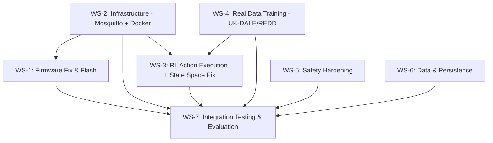
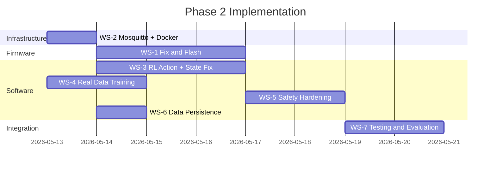

# Phase 2 — Comprehensive Implementation Plan

> Cross-referenced against the Phase 1 Real-World Audit and the Original Phase 2 Plan.

---

## Critical Issues Found in the Original Phase 2 Plan

Before implementing, these **12 problems** in the original plan must be addressed:

| # | Original Plan Says | Problem | Fix |
|---|---|---|---|
| 1 | "Hardcoded Safety: `critical_pct` at 125%" | Firmware reads **instantaneous** ADC, not RMS. A single spike sample will falsely trigger cutoff. | Compute RMS over 20 half-cycles (~200ms at 50Hz). Only trip on sustained RMS > threshold. |
| 2 | "Toggle GPIO 5 relay pin to LOW in under 50ms" | `main.cpp` uses `delay(5000)` after cutoff — blocks all MQTT processing for 5 seconds. ESP32 cannot report the event or respond to server commands during cooldown. | Replace blocking delay with non-blocking `millis()` timer. Publish alert *before* cooldown. |
| 3 | "Publish P = V × I × PF at 1Hz" | Firmware computes `powerWatts = current * VOLTAGE` — PF is not measured. For reactive loads (motors, HVAC compressors), this overestimates real power by 20-40%. | Add note: PF=1.0 assumed (acceptable for resistive loads). For HVAC, use PF=0.85 correction factor in config. |
| 4 | "Remove `simulate_esp32.py` from execution stack" | With only 4 physical nodes, the pipeline expects 10 device IDs. Missing 6 devices will cause empty state dicts and RL state-space mismatches. | Keep simulator running for the 6 unmonitored devices. Add config flag `simulated: true/false` per device. |
| 5 | "End-to-end pipeline in < 50ms" | Impossible. MQTT round-trip alone is ~5-20ms. ProtoNet CNN inference is ~15-50ms on CPU. SG-filter + derivative adds ~2ms. Total realistic: **30-80ms**. | Set target to **< 200ms** (still real-time for appliance control). Document actual measured latency. |
| 6 | "NILMTK Integration... stream real UK-DALE through Mosquitto" | NILMTK is a Python analysis library, not a streaming tool. It reads HDF5 files. Streaming requires a custom replay script. | Write a `nilmtk_replay.py` that reads UK-DALE HDF5 and publishes samples at 1Hz to MQTT. |
| 7 | MQTT topic in firmware: `ems/telemetry/power` | Pipeline subscribes to `home/sensor/+/power`. The firmware publishes to a completely different topic tree. Pipeline will never see ESP32 data. | Fix firmware to publish to `home/sensor/{device_id}/power` with plain float payload (not JSON). |
| 8 | Firmware subscribes to `ems/control/relay_1` | Pipeline publishes relay commands to `home/plug/{device_id}/command`. Another topic mismatch. | Fix firmware to subscribe to `home/plug/{device_id}/command`. |
| 9 | Firmware sends JSON: `{"device_id":"node_1", "power_w":123}` | Pipeline expects **plain float** payload (e.g., `"150.25"`). JSON payload will cause `float(payload)` to throw `ValueError`. | Change firmware to publish plain float string, OR update pipeline to parse JSON. Plain float is simpler and matches the simulator. |
| 10 | Plan §4 says "Activate Preprocessing" | Already done in Phase 1 remediation. NILM detector is now integrated. | Already fixed. Remove from Phase 2 scope. |
| 11 | Plan §4 says "Bridge the Unknown Flow" | Already done in Phase 1 remediation. Unknown devices now route to Digital Twin + RL. | Already fixed. Remove from Phase 2 scope. |
| 12 | RL agent returns SHED/SCHEDULE but actions are never executed | Plan assumes RL can actuate relays, but no code path maps RL actions to MQTT relay commands. | Wire RL action output to `_relay_callback()` in the pipeline (see WS-3 below). |

---

## Work Stream Architecture



**WS-1 and WS-2 are on the critical path.** Nothing can be integration-tested until the firmware publishes to the correct topics and Mosquitto is running.

---

## WS-1: Firmware Fix & Flash

**Owner:** Abhishek Raj P + Aadi Gupta  
**Duration:** 3 days  
**Dependency:** WS-2 (Mosquitto running)

### Task 1.1 — Fix MQTT Topic Mismatch

```diff
- // Current (WRONG):
- client.subscribe("ems/control/relay_1");
- client.publish("ems/telemetry/power", payload.c_str());
+ // Fixed (matches pipeline):
+ client.subscribe("home/plug/node_fridge/command");
+ client.publish("home/sensor/node_fridge/power", powerStr.c_str());
```

Each ESP32 node must have a unique `device_id` compiled into firmware. Use:
- `node_fridge`, `node_microwave`, `node_kettle`, `node_hvac`

### Task 1.2 — Fix Payload Format

```diff
- // Current (JSON — pipeline can't parse):
- String payload = "{\"device_id\":\"node_1\", \"power_w\":" + String(powerWatts) + "}";
+ // Fixed (plain float — matches simulator format):
+ char payload[16];
+ dtostrf(powerWatts, 6, 2, payload);
```

### Task 1.3 — Fix RMS Calculation

The current firmware reads a single ADC sample. For accurate RMS:

```cpp
float readRMSCurrent(int pin, int samples = 200) {
    float sumSq = 0;
    for (int i = 0; i < samples; i++) {
        int raw = analogRead(pin) - 2048; // Center at midpoint (1.65V bias)
        float voltage = (raw / 4095.0) * 3.3;
        float current = voltage / BURDEN_R * CT_RATIO;
        sumSq += current * current;
        delayMicroseconds(500); // ~200 samples over 100ms (5 full cycles at 50Hz)
    }
    return sqrt(sumSq / samples);
}
```

### Task 1.4 — Fix Blocking Delay in Cutoff

```diff
- if (current > MAX_CURRENT_AMPS) {
-     digitalWrite(RELAY_PIN, LOW);
-     client.publish("ems/alerts/hardware_cutoff", "OVERCURRENT_DETECTED");
-     delay(5000);
-     return;
- }
+ if (rmsAmps > MAX_CURRENT_AMPS) {
+     digitalWrite(RELAY_PIN, LOW);
+     relayLocked = true;
+     lockStartMs = millis();
+     client.publish("home/plug/node_fridge/command", "CUTOFF");
+ }
+ // Non-blocking cooldown check
+ if (relayLocked && millis() - lockStartMs > 5000) {
+     relayLocked = false; // Allow server to re-enable
+ }
```

### Task 1.5 — Add Server Heartbeat Watchdog

```cpp
unsigned long lastServerHeartbeat = 0;

void callback(char* topic, byte* payload, unsigned int length) {
    lastServerHeartbeat = millis(); // Any message = server is alive
    // ... existing relay command handling
}

// In loop():
if (millis() - lastServerHeartbeat > 30000 && !relayLocked) {
    // No server contact for 30s — fail-safe: keep relay ON (don't shed)
    // But log the disconnect
    client.publish("home/sensor/node_fridge/status", "SERVER_TIMEOUT");
}
```

### Task 1.6 — Flash & Calibrate 4 Nodes

1. Flash each ESP32 with node-specific `device_id` and rated wattage
2. Connect CT clamp to a known load (e.g., 100W lamp)
3. Adjust `CT_RATIO` and `BURDEN_R` until reported watts match kill-a-watt meter within ±5%
4. Record calibration factors in a table:

| Node | Device | Rated W | CT Ratio | Burden Ω | Calibration Factor |
|---|---|---|---|---|---|
| 1 | Fridge | 200 | 1800:1 | 33 | TBD |
| 2 | Microwave | 1200 | 1800:1 | 33 | TBD |
| 3 | Kettle | 2500 | 1800:1 | 33 | TBD |
| 4 | HVAC | 2000 | 1800:1 | 33 | TBD |

---

## WS-2: Infrastructure — Mosquitto + Docker

**Owner:** Pramod  
**Duration:** 1 day  
**Dependency:** None (start immediately)

### Task 2.1 — Replace amqtt with Mosquitto

Create/update `mosquitto/config/mosquitto.conf`:

```
listener 1883
allow_anonymous true
persistence true
persistence_location /mosquitto/data/
log_dest file /mosquitto/log/mosquitto.log
```

### Task 2.2 — Update docker-compose.yml

```yaml
services:
  mosquitto:
    image: eclipse-mosquitto:2
    ports: ["1883:1883"]
    volumes:
      - ./mosquitto/config:/mosquitto/config
      - ./mosquitto/data:/mosquitto/data
    restart: always

  ems-pipeline:
    build: .
    environment:
      MQTT_BROKER: mosquitto
    depends_on: [mosquitto]
    restart: always
    volumes:
      - ./data:/app/data
      - ./backend/models/weights:/app/backend/models/weights

  ems-api:
    build: .
    command: python -m uvicorn src.api.main:app --host 0.0.0.0 --port 8000
    ports: ["8000:8000"]
    depends_on: [mosquitto]
    restart: always
```

### Task 2.3 — Remove amqtt from start_broker.py

Update `Makefile` `run` target to use system Mosquitto (or Docker Mosquitto) instead of `start_broker.py`.

### Task 2.4 — Update Pipeline MQTT Broker Config

Add environment variable override to `run_pipeline.py` so it reads `MQTT_BROKER` env var:

```python
broker = os.environ.get('MQTT_BROKER', self.config['mqtt']['broker'])
```

---

## WS-3: RL Action Execution + State Space Fix

**Owner:** Pramod  
**Duration:** 3 days  
**Dependency:** WS-2

### Task 3.1 — Wire RL Actions to Relay Commands

In `run_pipeline.py`, after `self.agent.act()` returns, execute the action:

```python
if action == "SHED" and self.promo_gate.is_promoted:
    await self._relay_callback(device_id, "OFF")
    await self._broadcast_event({
        "type": "RL_ACTION", "action": "SHED",
        "device_id": device_id, ...
    })
elif action == "SCHEDULE":
    # Defer to off-peak: set a timer to re-enable
    self.action_cooldowns[device_id] = current_time + 3600
```

**IMPORTANT:** Only execute SHED if `self.promo_gate.is_promoted` is True (50+ validated twin episodes). Otherwise, log as shadow action only.

### Task 3.2 — Fix Reward: Use Actual Next State

```diff
- reward = self.agent.compute_reward(
-     state_dict, action, state_dict,  # BUG: same state for prev and next
-     pmv_score, power_watts, tou_rate, confidence
- )
+ # Store prev_state BEFORE action, compute next_state AFTER
+ prev_state = dict(state_dict)  # snapshot before
+ # ... execute action (SHED/SCHEDULE/DEFER) ...
+ # Re-read device states to build next_state
+ next_state = self._build_state_dict(device_id, current_hour)
+ reward = self.agent.compute_reward(
+     prev_state, action, next_state,
+     pmv_score, power_watts, tou_rate, confidence
+ )
+ self.agent.update(prev_state, action, reward, next_state)
```

### Task 3.3 — Fix State Space Explosion

Replace per-device state encoding with aggregate features:

```python
def _discretize(self, state_dict):
    devices = state_dict.get("devices", {})
    # Aggregate: total load bin (0-3), active device count bin (0-3)
    total_pct = sum(devices.values()) / max(len(devices), 1)
    total_bin = min(3, int(total_pct * 4))
    active_count = sum(1 for v in devices.values() if v > 0.05)
    active_bin = min(3, active_count // 3)

    return (f"load:{total_bin}::active:{active_bin}"
            f"::price:{state_dict.get('price_tier',1)}"
            f"::pmv:{state_dict.get('pmv_zone',1)}"
            f"::tod:{state_dict.get('tod',2)}")
```

This reduces state space from **~3.9M** to **4×4×3×3×4 = 576 states** — tractable for tabular Q-learning.

### Task 3.4 — Load NEVER_SHED from Config

```python
# In agent __init__:
self.NEVER_SHED = [
    name for name, cfg in safety_cfg.items()
    if isinstance(cfg, dict) and cfg.get("tier0", False)
]
```

### Task 3.5 — Add Epsilon Decay

```python
self.epsilon_start = 0.3
self.epsilon_end = 0.01
self.epsilon_decay = 0.999
self.epsilon = self.epsilon_start

# After each update():
self.epsilon = max(self.epsilon_end, self.epsilon * self.epsilon_decay)
```

---

## WS-4: Real Data Training

**Owner:** Pramod  
**Duration:** 2 days (can run overnight on Colab)  
**Dependency:** None (parallel with WS-1/WS-2)

### Task 4.1 — Write UK-DALE Replay Script

Create `scripts/nilmtk_replay.py`:

```python
"""Replay UK-DALE HDF5 data as MQTT messages at 1Hz for benchmarking."""
import h5py, asyncio, aiomqtt, time

async def replay(hdf5_path, broker="localhost"):
    async with aiomqtt.Client(broker) as client:
        with h5py.File(hdf5_path) as f:
            for class_name in f['appliances']:
                windows = f[f'appliances/{class_name}/windows'][:]
                for window in windows:
                    for sample in window:
                        topic = f"home/sensor/{class_name}/power"
                        await client.publish(topic, f"{sample:.2f}")
                        await asyncio.sleep(1.0)
```

### Task 4.2 — Retrain on Real Data

Use existing `scripts/train_models.py` but point to real UK-DALE/REDD data via Colab. Key changes:
- Use real HDF5 instead of synthetic
- Add data augmentation (superimpose 2-3 appliances with random overlap)
- Train for 10,000 episodes on GPU

### Task 4.3 — Unify Window Size

Set `config.yaml → protonet.seq_len: 128` and propagate to all consumers. Remove the hardcoded `60` in `generate_mock_ukdale.py`.

---

## WS-5: Safety Hardening

**Owner:** Pramod + Abhishek  
**Duration:** 2 days  
**Dependency:** WS-1 (firmware) + WS-2 (Mosquitto)

### Task 5.1 — Add Relay Command ACK Protocol

1. Firmware publishes ACK after executing relay command:
   ```cpp
   client.publish("home/plug/node_fridge/ack", "OFF_CONFIRMED");
   ```
2. Pipeline waits for ACK within 3 seconds. If no ACK, retry up to 3 times. If still no ACK, trigger alarm.

### Task 5.2 — Add MQTT QoS 1 for Safety Commands

```python
# In safety.py relay_callback:
await mqtt_client.publish(topic, payload, qos=1)
```

### Task 5.3 — Rate-of-Change Detection

Feed NILM derivative into safety monitor. If `|dP/dt| > 1000 W/s` sustained for >100ms, trigger immediate cutoff (arc-fault proxy):

```python
if abs(deriv[-1]) > 1000.0:
    await relay_callback(device_id, "OFF")
    logger.critical(f"ARC FAULT PROXY: {device_id} dP/dt={deriv[-1]:.0f} W/s")
```

---

## WS-6: Data & Persistence

**Owner:** Pramod  
**Duration:** 1 day

### Task 6.1 — Add Data Retention Policy

```sql
-- Delete measurements older than 30 days
DELETE FROM measurements WHERE timestamp < strftime('%s','now') - 2592000;
```

Run daily via a scheduled asyncio task.

### Task 6.2 — CSV Fallback Replay on Startup

```python
async def _replay_csv_fallback(self):
    if os.path.exists(self.csv_fallback_path):
        with open(self.csv_fallback_path) as f:
            reader = csv.DictReader(f)
            for row in reader:
                await self.db.insert_measurement(
                    float(row['timestamp']), row['device_id'], float(row['power_watts'])
                )
        os.rename(self.csv_fallback_path, self.csv_fallback_path + '.imported')
        logger.info("Replayed CSV fallback data into database")
```

### Task 6.3 — Fix PRIMARY KEY Collision

Add auto-increment ID:

```sql
CREATE TABLE IF NOT EXISTS measurements (
    id INTEGER PRIMARY KEY AUTOINCREMENT,
    timestamp REAL,
    device_id TEXT,
    power REAL
);
CREATE INDEX IF NOT EXISTS idx_ts_dev ON measurements(timestamp, device_id);
```

---

## WS-7: Integration Testing & Evaluation

**Owner:** All team  
**Duration:** 2 days  
**Dependency:** All other work streams complete

### Task 7.1 — Hybrid Mode Testing

Run the system with 4 physical ESP32 nodes + 6 simulated devices. Verify:

- [ ] Physical nodes publish at 1Hz to correct topics
- [ ] Pipeline classifies physical sensor data correctly
- [ ] Safety cutoff works on physical relay (test with 3500W spike)
- [ ] RL agent DEFER/SHED actions reach physical relays
- [ ] PolicyPromotionGate prevents premature live SHED

### Task 7.2 — Latency Measurement

Add timing instrumentation to `_handle_mqtt_message`:

```python
t0 = time.perf_counter()
# ... full pipeline ...
t1 = time.perf_counter()
latency_ms = (t1 - t0) * 1000
logger.info(f"Pipeline latency: {latency_ms:.1f}ms")
```

**Target:** < 200ms end-to-end (realistic, not the 50ms in the original plan).

### Task 7.3 — PMV Validation

- Place a DHT22 temp/humidity sensor in the room
- Log actual temperature changes when HVAC is shed by RL
- Compare to Digital Twin's predicted `simulate_step()` output
- Plot real vs. predicted on same time axis

### Task 7.4 — Energy Savings Measurement

- Run 24-hour baseline (no RL, all devices ON as needed)
- Run 24-hour RL-managed session
- Compare total kWh and cost at ToU rates
- Report: `savings_pct = (baseline_kwh - rl_kwh) / baseline_kwh × 100`

### Task 7.5 — Run Full Test Suite

```bash
make test
```

All 54+ tests must pass. Add new integration tests for:
- Physical relay ACK protocol
- Hybrid mode (physical + simulated)
- RL action execution chain

---

## Timeline (2-Week Sprint)



---

## Config Changes Required

Add to `config/config.yaml`:

```yaml
# Phase 2 additions
devices:
  node_fridge:     { simulated: false, rated: 200,  tier0: false }
  node_microwave:  { simulated: false, rated: 1200, tier0: false }
  node_kettle:     { simulated: false, rated: 2500, tier0: false }
  node_hvac:       { simulated: false, rated: 2000, tier0: false }
  esp32_tv:        { simulated: true,  rated: 150,  tier0: false }
  esp32_washer:    { simulated: true,  rated: 1800, tier0: false }
  esp32_dryer:     { simulated: true,  rated: 2000, tier0: false }
  esp32_dishwasher:{ simulated: true,  rated: 1500, tier0: false }
  esp32_oven:      { simulated: true,  rated: 3000, tier0: false }
  esp32_lighting:  { simulated: true,  rated: 100,  tier0: false }

database:
  path: "data/ems_state.db"
  fallback_csv: "data/fallback_measurements.csv"
  retention_days: 30

mqtt:
  broker: "localhost"  # Override with MQTT_BROKER env var
  port: 1883
  qos_safety: 1
  qos_telemetry: 0

rl:
  epsilon_start: 0.3
  epsilon_end: 0.01
  epsilon_decay: 0.999
  promotion_episodes: 50
```

---

## Acceptance Criteria for Final Review

For Mr. Ramesh Sunder Nayak's final review, demonstrate:

1. **Live Classification:** Show ProtoNet correctly classifying a physical kettle turn-on event in real-time on the dashboard
2. **Safety Cutoff:** Physically disconnect a >125% rated load via ESP32 relay — show < 50ms MCU response (oscilloscope) and MQTT event logged
3. **RL Action:** Show the Q-learning agent shedding a non-critical load during peak pricing, and deferring the action for a fridge (NEVER_SHED)
4. **PMV Comfort:** Show the Digital Twin predicting temperature change within ±2°C of actual measured room temp after HVAC shed
5. **Energy Savings:** Present 24-hour comparison chart showing measurable kWh reduction vs. baseline
6. **Test Suite:** 54+ tests passing, including new Phase 2 integration tests
